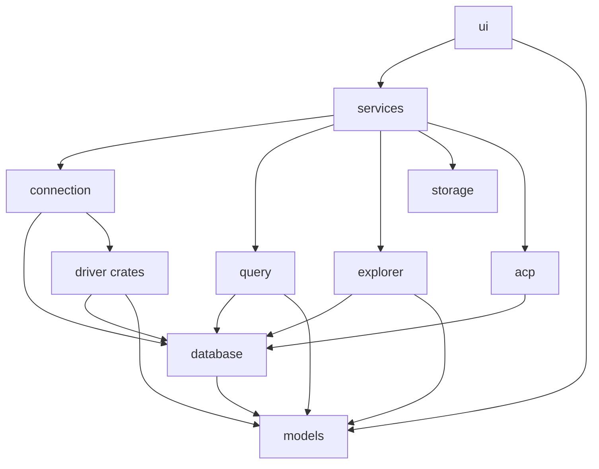

# Shovel Architecture

This document describes how Shovel is organized at the code level. It complements
[`AGENTS.md`](./AGENTS.md), which captures the editorial project rules.

For the product surface, install instructions, and supported databases, see
[`README.md`](./README.md).

## Bird's-eye view

Live work goes through a capability session, not a pool enum. `ui` talks to
`services` with `session_id`. Drivers own catalog SQL, execute, decode,
mutations, explain, and ACP introspection. `query` keeps pagination, batch,
format, and import/export, and calls `handle.dialect()` plus `QueryExec`.

`DatabaseKind` is the connect-form selector: display name, default port, and
which of the four forms to show. After connect, execute / explore / ACP go
through `Capabilities` plus the exec traits on `SessionHandle`. `query` still
matches `handle.kind()` for row locators, DDL (create / truncate / rename /
duplicate), and CSV import — a fifth backend still has to touch those arms.
`explorer` and `acp` do not match `DatabaseKind`.



`app` launches `ui` (desktop) or the embedded ACP agent. `connection` uses
`connection-ssh` for tunnels. `acp` uses `acp-core` and `acp-registry`. Those
edges are unchanged; they are omitted from the diagram so the session boundary
stays visible.

`database` depends on `models` (DTOs). `models` does not depend on `database`.
There is no cycle.

The only list of built-in drivers lives in `connection` (registration at
`connect_to_db`). A later first-party backend is a driver crate, one factory
arm, and a new connect form in `ui`.

## Crate ownership

From the driver-session spec:

| Crate | Owns | Does not own |
| --- | --- | --- |
| `models` | `DatabaseKind`, `Capabilities`, `ConnectionRequest`, connect forms, `QueryOutput`, `DatabaseError` without sqlx | pools, sqlx, driver traits |
| `database` | `SessionHandle`, private erasure, `Dialect`, traits `QueryExec` / `SchemaExec` / `MutateExec` / `ExplainExec` / `IntrospectExec` | concrete SQL, the pool, SSH |
| `driver-*` | pool, catalog SQL, execute, row decode, mutations, explain, ACP introspection | pagination as a product, UI, SSH |
| `connection` | SSH, built-in driver factory, `session_id → SessionHandle` registry | query SQL |
| `query` | pagination, batch, format, import/export; locators, DDL, and CSV import still switch on `DatabaseKind` | `driver-*`, sqlx |
| `explorer` | proxy to `SchemaExec` | `sqlite.rs` / `postgres.rs` / `mysql.rs` modules |
| `acp` | agent orchestration; DB context via `IntrospectExec` and `QueryExec` | match on the pool |
| `services` | public functions that take `session_id` | |
| `ui` | four connect forms, capabilities snapshot on `ConnectionSession` | `SessionHandle`, the pool |

## Layer rules

The workspace is organized into four layers. New code should respect them.

1. **Drivers** (`driver-*`, `database`)
   - `DatabaseDriver` is only the pool factory: `async fn connect(info) -> Result<Pool, Error>`.
     `connection` uses it when constructing `SqliteSession` / `PostgresSession` /
     `MysqlSession` / `ClickHouseSession`. It is not the query/schema/mutate API.
   - Live work is `database::SessionHandle` (`Clone` via `Arc<dyn DriverSession>`).
     Erasure is private. Callers use `kind()`, `capabilities()`, `dialect()`,
     `query()`, `schema()`, `mutate()`, `explain()`, and `introspect()`.
   - Drivers own catalog SQL, execute, row decode, mutations, explain, and ACP
     introspection. They map `sqlx`/HTTP errors to `DatabaseError::Driver(String)`
     so higher layers do not take a `sqlx::Error`.
   - `database` also ships `FakeDriver` behind `feature = "fake"` for in-memory
     tests (`query` / `services` / registry) with no sqlx.
   - Driver crates must not depend on `ui`, `app`, `services`, or ACP code.

2. **Domain & persistence** (`models`, `storage`, `explorer`, `query`,
   `connection`, `connection-ssh`)
   - `models` holds serializable types, settings, `Capabilities`, connect forms,
     `QueryOutput`, and `DatabaseError` (`Driver`, `Tunnel`, `Unsupported`,
     `SessionNotFound`). It does not depend on sqlx and does not store a pool.
     `ConnectionSession` is `id`, `name`, `kind`, `request`, `capabilities`.
   - `storage` owns local persistence: JSON files, `shovel.db`, and the system
     keyring. Secrets must use `keyring`; there is intentionally no plaintext
     fallback. Live pools are not serialized.
   - `connection` opens SSH tunnels, constructs the built-in `*Session` types,
     and holds `RwLock<HashMap<u64, SessionHandle>>`. `connect_to_db` returns a
     handle; it does not register it. `app_state` allocates `session_id` and
     calls `register_session`. Lookup for `query` / `explorer` / `acp` is only
     through `services`.
   - `query` builds paginated SQL with `handle.dialect()` and runs it with
     `handle.query()`. Format, batch, and import/export stay here. Production
     `query` does not depend on `driver-*` or sqlx. Locators, DDL, and CSV
     import still match `DatabaseKind`; a fifth backend still edits `query`
     for those. `explorer` and `acp` do not.
   - `explorer` is a thin proxy to `handle.schema()`.

3. **AI runtime** (`acp-core`, `acp`, `acp-registry`)
   - `acp-core` is a DB-independent ACP runtime: DeepSeek/Ollama bridges,
     specialist agents, JSON-RPC transport.
   - `acp` adds DB context through `handle.introspect()` when present, and can
     always send SQL through `handle.query()`. Missing introspect means a
     context without locks / active queries, not a connect error.
   - `acp-registry` is a separate crate so the registry format can evolve
     independently of the runtime.

4. **Facade & UI** (`services`, `ui`, `app`)
   - `services` is the session_id API. Operational calls look up the handle or
     return `DatabaseError::SessionNotFound`. New functions belong in their
     domain crate first (`query`, `explorer`, `connection`, `storage`, `acp`),
     then get a `session_id` wrapper here.
   - `ui` may import `models` and `services` freely. It must not import
     `connection`, `explorer`, `query`, `storage`, `database`, or `acp`
     directly, and must not hold a pool or `SessionHandle` on
     `ConnectionSession`. Workspace edit / explain / import buttons read the
     capabilities snapshot, not `DatabaseKind`.
   - `app` is the desktop binary. It owns the launch sequence, the window
     configuration, the crash reporter, and the embedded ACP agent mode
     (`shovel acp-agent deepseek|ollama ...`).

## SessionHandle and capabilities

```text
SessionHandle { Arc<dyn DriverSession> }
  kind() / capabilities() / dialect()
  query() -> &dyn QueryExec
  schema() -> &dyn SchemaExec
  mutate() -> Option<&dyn MutateExec>
  explain() -> Option<&dyn ExplainExec>
  introspect() -> Option<&dyn IntrospectExec>
```

Invariants on every built-in driver:

- `capabilities.row_editing == mutate().is_some()`
- `capabilities.explain == explain().is_some()`

`import_csv` is independent of `row_editing`. ClickHouse can import CSV and
does not implement `MutateExec`; there is no stub `update_cell`. If a call
reaches an absent capability, the handle returns `DatabaseError::Unsupported`.

`Dialect` is a `Copy` struct of function pointers (`quote_identifier`,
`filter_expression`) plus `format_flavor` (`Postgres` | `Generic`) so
`format_sql` does not match `DatabaseKind`.

## Runtime flow

### Desktop launch

1. `app/src/main.rs::main` sets `RUST_BACKTRACE=full` and installs the crash
   hook.
2. The crash hook captures the panic info, sanitizes credentials, writes a
   report to `temp/shovel/crash-<timestamp>.log`, and shows a native error
   dialog.
3. If the binary was invoked as `shovel acp-agent <name> ...`, the embedded
   ACP agent runs in a headless tokio runtime and the process exits when the
   agent exits.
4. Otherwise, `launch_app` configures the Dioxus desktop window and starts
   `ui::App`. The window is frameless (`with_decorations(false)`) at
   1440×920 with a 720×480 minimum. The Wayland DMA-BUF path is preferred
   unless `SHOVEL_DISABLE_WAYLAND_GPU=1`.

### UI startup

`ui::App` (`ui/src/app.rs`) does the following in order:

1. Load persisted startup settings via `services::load_app_startup_settings`.
2. Replace the in-memory `APP_UI_SETTINGS` and `APP_SQL_FORMAT_SETTINGS`
   signals.
3. If `restore_session_on_launch` is enabled, restore the previously open
   connection sessions via `services::restore_saved_sessions`.
4. Mount two `use_effect` watchers that persist any change to those signals
   back to `storage`.

If there are no open sessions, the connect screen (`DbConnect`) is shown
instead of the workspace.

### Connection lifecycle

`connection::connect_to_db` is the single entry point for opening a live
connection. It returns `SessionHandle`. It does not insert into the registry.

- SQLite connects directly.
- PostgreSQL, MySQL, and ClickHouse can be routed through an SSH tunnel.
- PostgreSQL and MySQL reject SSH tunneling when the host is a DSN string.
- ClickHouse parses URL-like host fields before deciding on tunneling.
- Each tunnel is registered by session identity key and released via
  `services::release_ssh_tunnel` when the session is removed.

Connect path:

1. UI collects one of the four forms → `ConnectionRequest`.
2. `services::connect_and_save_request` calls `connection::connect_to_db`
   (SSH if needed, then the driver factory on `request.kind()`).
3. `app_state` allocates `session_id`, copies `handle.capabilities()` onto
   `ConnectionSession`, and calls `register_session`.
4. Passwords stay in the keyring. The pool is not stored in `models` or UI.

Restore on launch replays saved `ConnectionRequest`s through `connect_to_db`.
The pool is not serializable.

Remove a session only through `app_state::remove_session`: unregister the
handle, `release_ssh_tunnel`, drop the pool. UI must not call the driver
directly. Clone the handle (Arc) from the registry before any `.await`; do
not hold the registry lock across await.

### services session_id API

`query`, `explorer`, and `acp` take `&SessionHandle`. `ui` and windows pass
`session_id`. `services` looks up the handle:

```text
execute_query_page(session_id, sql, page_size, offset, filter, sort)
load_connection_tree(session_id)
build_acp_database_context(session_id)
```

Missing id → `DatabaseError::SessionNotFound`. Import requires
`capabilities.import_csv`; otherwise `Unsupported`, not a ClickHouse branch.

### Query execution and table editing

`query` is one crate with modules `core`, `format`, and `io`:

- `core` — `execute_query`, `execute_query_page`, `load_table_preview_page`,
  `insert_table_row`, `update_table_cell`, `delete_table_row`,
  `create_table`, `drop_table`, `duplicate_table`, `truncate_table`,
  `next_table_primary_key_id`, `execute_explain`,
  `preview_source_for_sql`, `is_read_only_sql`.
- `format` — `format_sql` (flavor from `handle.dialect()`).
- `io` — `export_query_page_csv/json/xlsx/xml/html/sql_dump` and
  `import_csv_into_table`.

Pagination SQL is built in `query`. Drivers execute the built SQL and decode
rows. Locators, DDL, and CSV import in `query` still switch on `DatabaseKind`.
Editable table workflows follow `capabilities.row_editing` (SQLite,
PostgreSQL, MySQL today). ClickHouse supports connect/explore/query/export
and CSV import, but not row editing.

### ACP runtime

`acp-core` is the heart of the AI layer.

- `runtime.rs` runs a JSON-RPC transport over stdio, manages ACP sessions,
  permission requests, terminal tools, and file IO, and bridges events back
  into the UI.
- `agents.rs` defines a coordinator that routes prompts to one of three
  specialists — `SqlExpert`, `SchemaArchitect`, `DataAnalyst` — based on
  the user intent classified by `IntentClassifier`.
- `deepseek.rs` and `ollama.rs` ship the embedded agent bridges that the
  desktop app can spawn as child processes via the `shovel acp-agent`
  entrypoint.
- `embedding` (feature-gated) provides the semantic cache for prompts and
  completions, persisted in `shovel.db` via sqlite-vec.

UI consumers should always go through `services::send_acp_prompt`,
`services::connect_acp_agent`, etc., rather than reaching into `acp::*`
directly.

## Persistence model

All local app data lives under `dirs::data_local_dir()/shovel/`.

Live connections are **not** persisted. The in-memory registry in `connection`
holds `session_id → SessionHandle` for the process lifetime. `session_state.json`
stores open `ConnectionRequest`s and the active connection key; restore
reconnects.

| Path | Owner | Contents |
| --- | --- | --- |
| `saved_connections.json` | `storage` | Connection metadata without passwords |
| `session_state.json` | `storage` | Open connection requests and the active connection key |
| `saved_queries.json` | `storage` | User-saved SQL queries, organized by folder |
| `query_history.json` | `storage` | Recent query log (legacy file) |
| `sql_format_settings.json` | `storage` | SQL formatter settings |
| `app_ui_settings.json` | `storage` | Theme, panel visibility, default page size, tool layout |
| `shovel.db` | `storage` | Chat threads with FTS5 search, sqlite-vec semantic cache, query history store |
| `acp/workspace/...` | `storage` | Per-agent workspace files |
| `crash-*.log` | `app` | Crash reports (only when something panics) |

Secrets (connection passwords, CodeStral/DeepSeek API keys) are stored in the
system keyring under the service `shovel.connections` and the user keyring
respectively. Secret entries are keyed by a hashed `request.identity_key()`;
legacy entries keyed by display name are still supported and migrated forward
on first read.

## Build and tooling

Local development commands:

```bash
cargo run -p app --features desktop
cargo build -p app --release --features desktop
cargo check --workspace
cargo test --workspace
```

CI (`.github/workflows/test.yml`) runs:

```bash
cargo fmt --all -- --check
cargo clippy --workspace --all-targets -- -D warnings
cargo test --workspace
cargo audit
```

Linux and Windows dependencies for Dioxus Desktop are installed before the
Rust build steps in CI.

## Where things tend to be edited

- **UI work** typically touches `ui/src/app_state.rs`,
  `ui/src/screens/workspace/mod.rs`, and one or more files under
  `ui/src/screens/workspace/components/`.
- **Connection or driver work** belongs in `connection`, `connection-ssh`,
  or the relevant `driver-*` crate. UI callers keep passing `session_id`.
- **ACP work** belongs in `acp-core` for transport/agents and `acp` for
  DB-aware features. Update `services` re-exports if the new public function
  needs to be reachable from `ui`.
- **Adding a new persisted UI setting** means updating
  `models/src/settings.rs`, the matching `set_*` helper in
  `ui/src/app_state.rs`, the settings modal, and any panel/toolbar that
  should respect it.

## Common change patterns

For project rules, hotspot warnings, and Dioxus-specific guidance, see
[`AGENTS.md`](./AGENTS.md). The most relevant sections for contributors are
“Hotspots and risk areas”, “Dioxus-specific guidance for this repo”, and
“Persisted UI settings”.
