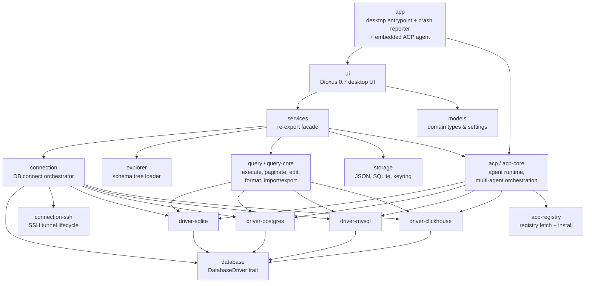

# Shovel Architecture

This document describes how Shovel is organized at the code level. It complements
[`AGENTS.md`](./AGENTS.md), which captures the editorial project rules.

For the product surface, install instructions, and supported databases, see
[`README.md`](./README.md).

## Bird's-eye view



## Layer rules

The workspace is organized into four layers. New code should respect them.

1. **Drivers** (`driver-*`, `database`)
   - Implement the `DatabaseDriver` trait from `database`.
   - Translate `sqlx`/HTTP errors into a `String` so higher layers do not need
     to know about `sqlx::Error`.
   - Never depend on `ui`, `app`, `services`, `models`, or any ACP code.

2. **Domain & persistence** (`models`, `storage`, `explorer`, `query`,
   `connection`, `connection-ssh`)
   - Pure Rust on top of drivers and `sqlx`/`reqwest`.
   - `models` holds serializable types and settings. It is the only crate
     imported by `ui` for types — never reach into driver crates from `ui`.
   - `storage` owns local persistence: JSON files, the `shovel.db` SQLite
     database, and the system keyring. Secrets must use `keyring`; there is
     intentionally no plaintext fallback.

3. **AI runtime** (`acp-core`, `acp`, `acp-registry`)
   - `acp-core` is a DB-independent ACP runtime: DeepSeek/Ollama bridges,
     specialist agents, JSON-RPC transport.
   - `acp` adds DB context, schema introspection, and the optional embedding
     cache (`feature = "embedding"`).
   - `acp-registry` is a separate crate so the registry format can evolve
     independently of the runtime.

4. **Facade & UI** (`services`, `ui`, `app`)
   - `services` is a thin re-export facade. It is the only crate the UI is
     expected to import operation calls from. New operational functions belong
     in their domain crate first, then get re-exported here.
   - `ui` may import `models` and `services` freely. It must not import
     `connection`, `explorer`, `query`, `storage`, or `acp` directly.
   - `app` is the desktop binary. It owns the launch sequence, the window
     configuration, the crash reporter, and the embedded ACP agent mode
     (`shovel acp-agent deepseek|ollama ...`).

## Runtime flow

### Desktop launch

1. `app/src/main.rs::main` sets `RUST_BACKTRACE=full` and installs the crash
   hook.
2. The crash hook captures the panic info, sanitizes credentials, writes a
   report to `temp/shovel/crash-<timestamp>.log`, and shows a native error
   dialog.
3. If the binary was invoked as `shovel acp-agent <name> ...`, the embedded
   ACP agent runs in a headless tokio runtime and the process exits when the
   agent exits.
4. Otherwise, `launch_app` configures the Dioxus desktop window and starts
   `ui::App`. The window is frameless (`with_decorations(false)`) at
   1440×920 with a 720×480 minimum. The Wayland DMA-BUF path is preferred
   unless `SHOVEL_DISABLE_WAYLAND_GPU=1`.

### UI startup

`ui::App` (`ui/src/app.rs`) does the following in order:

1. Load persisted startup settings via `services::load_app_startup_settings`.
2. Replace the in-memory `APP_UI_SETTINGS` and `APP_SQL_FORMAT_SETTINGS`
   signals.
3. If `restore_session_on_launch` is enabled, restore the previously open
   connection sessions via `services::restore_saved_sessions`.
4. Mount two `use_effect` watchers that persist any change to those signals
   back to `storage`.

If there are no open sessions, the connect screen (`DbConnect`) is shown
instead of the workspace.

### Connection lifecycle

`connection::connect_to_db` is the single entry point for opening a live
connection.

- SQLite connects directly.
- PostgreSQL, MySQL, and ClickHouse can be routed through an SSH tunnel.
- PostgreSQL and MySQL reject SSH tunneling when the host is a DSN string.
- ClickHouse parses URL-like host fields before deciding on tunneling.
- Each tunnel is registered by session identity key and released via
  `services::release_ssh_tunnel` when the session is removed.

When a session is removed, both the SSH tunnel and the saved connection
metadata are cleaned up. UI code should go through
`app_state::remove_session` rather than calling `release_ssh_tunnel` directly.

### Query execution and table editing

`query` re-exports three sub-crates:

- `query-core` — `execute_query`, `execute_query_page`, `load_table_preview_page`,
  `insert_table_row`, `update_table_cell`, `delete_table_row`,
  `create_table`, `drop_table`, `duplicate_table`, `truncate_table`,
  `next_table_primary_key_id`, `execute_explain`,
  `preview_source_for_sql`, `is_read_only_sql`.
- `query-format` — `format_sql`.
- `query-io` — `export_query_page_csv/json/xlsx/xml/html/sql_dump` and
  `import_csv_into_table`.

Editable table workflows are only supported for SQLite, PostgreSQL, and MySQL
today. ClickHouse supports connect/explore/query/export but not row editing.

### ACP runtime

`acp-core` is the heart of the AI layer.

- `runtime.rs` runs a JSON-RPC transport over stdio, manages ACP sessions,
  permission requests, terminal tools, and file IO, and bridges events back
  into the UI.
- `agents.rs` defines a coordinator that routes prompts to one of three
  specialists — `SqlExpert`, `SchemaArchitect`, `DataAnalyst` — based on
  the user intent classified by `IntentClassifier`.
- `deepseek.rs` and `ollama.rs` ship the embedded agent bridges that the
  desktop app can spawn as child processes via the `shovel acp-agent`
  entrypoint.
- `embedding` (feature-gated) provides the semantic cache for prompts and
  completions, persisted in `shovel.db` via sqlite-vec.

UI consumers should always go through `services::send_acp_prompt`,
`services::connect_acp_agent`, etc., rather than reaching into `acp::*`
directly.

## Persistence model

All local app data lives under `dirs::data_local_dir()/shovel/`.

| Path | Owner | Contents |
| --- | --- | --- |
| `saved_connections.json` | `storage` | Connection metadata without passwords |
| `session_state.json` | `storage` | Open connection requests and the active connection key |
| `saved_queries.json` | `storage` | User-saved SQL queries, organized by folder |
| `query_history.json` | `storage` | Recent query log (legacy file) |
| `sql_format_settings.json` | `storage` | SQL formatter settings |
| `app_ui_settings.json` | `storage` | Theme, panel visibility, default page size, tool layout |
| `shovel.db` | `storage` | Chat threads with FTS5 search, sqlite-vec semantic cache, query history store |
| `acp/workspace/...` | `storage` | Per-agent workspace files |
| `crash-*.log` | `app` | Crash reports (only when something panics) |

Secrets (connection passwords, CodeStral/DeepSeek API keys) are stored in the
system keyring under the service `shovel.connections` and the user keyring
respectively. Secret entries are keyed by a hashed `request.identity_key()`;
legacy entries keyed by display name are still supported and migrated forward
on first read.

## Build and tooling

Local development commands:

```bash
cargo run -p app --features desktop
cargo build -p app --release --features desktop
cargo check --workspace
cargo test --workspace
```

CI (`.github/workflows/test.yml`) runs:

```bash
cargo fmt --all -- --check
cargo clippy --workspace --all-targets -- -D warnings
cargo test --workspace
cargo audit
```

Linux and Windows dependencies for Dioxus Desktop are installed before the
Rust build steps in CI.

## Where things tend to be edited

- **UI work** typically touches `ui/src/app_state.rs`,
  `ui/src/screens/workspace/mod.rs`, and one or more files under
  `ui/src/screens/workspace/components/`.
- **Connection or driver work** belongs in `connection`, `connection-ssh`,
  or the relevant `driver-*` crate. UI callers should not change.
- **ACP work** belongs in `acp-core` for transport/agents and `acp` for
  DB-aware features. Update `services` re-exports if the new public function
  needs to be reachable from `ui`.
- **Adding a new persisted UI setting** means updating
  `models/src/settings.rs`, the matching `set_*` helper in
  `ui/src/app_state.rs`, the settings modal, and any panel/toolbar that
  should respect it.

## Common change patterns

For project rules, hotspot warnings, and Dioxus-specific guidance, see
[`AGENTS.md`](./AGENTS.md). The most relevant sections for contributors are
“Hotspots and risk areas”, “Dioxus-specific guidance for this repo”, and
“Persisted UI settings”.
