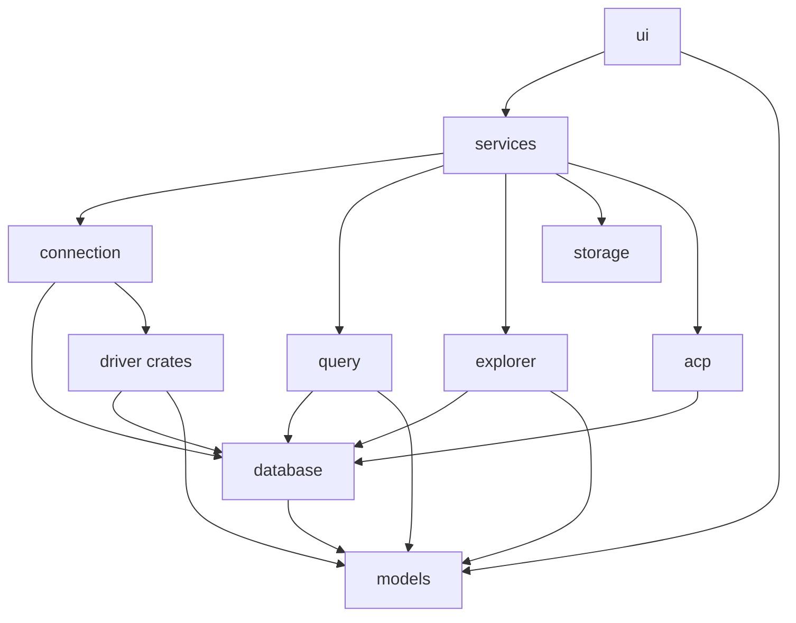

# Shovel: модульность драйверов и capability-сессия — дизайн

Дата: 2026-08-27
Статус: утверждён (brainstorming)

## Проблема

Workspace уже разрезан на крейты, но живое соединение это
`models::DatabaseConnection`: enum из `sqlx` пулов и `ClickHouseFormData`.
Из-за этого:

1. `models` зависит от sqlx. Слой «типов» держит рантайм.
2. `query`, `explorer`, `acp`, `query-io` и куски UI делают
   `match DatabaseConnection { Sqlite | Postgres | MySql | ClickHouse }`.
   Новая операция размножается по крейтам.
3. `DatabaseDriver` умеет почти только `connect()`. ClickHouse JSON-методы
   торчат в общем трейте и тянут `models` в `database`.
4. Поведение UI (можно ли редактировать строки, SSH) зашито в
   `DatabaseKind::supports_*`, то есть снова в имя СУБД.
5. `services` реэкспортирует функции, но UI прокидывает пул как проп. Фасад
   не граница.

Плагинов нет и в этой работе не будет. Цель другая: first-party бэкенд
перестаёт быть веткой enum.

## Цели

- Операционный слой (`query`, `explorer`, `connection`, `acp`) не матчит
  конкретную СУБД, чтобы выполнить запрос, открыть дерево, сменить ячейку
  или собрать ACP-контекст.
- Workspace UI включает редактирование / explain / import по снимку
  `Capabilities`, не по `is_clickhouse()`.
- `models` не зависит от sqlx и не хранит пул.
- `services` принимает `session_id`, не пул.
- Четыре текущих бэкенда остаются рабочими на каждой фазе миграции.

## Не цели

- Хост сторонних плагинов (WASM, `cdylib`, отдельный процесс).
- Data-driven форма коннекта. Четыре экрана в UI остаются.
- Нарезка `ui` ради скорости компиляции.
- Повтор спеки отзывчивости
  (`docs/superpowers/specs/2026-08-25-responsiveness-architecture-design.md`).

## Подход

Выбран **capability-сессия + SQL бэкенда в `driver-*` + общий query-движок**.

Отклонено:

- Толстый трейт, где каждый драйвер сам пишет пагинацию и фильтры. Четыре
  копии одного алгоритма.
- Фасад поверх текущего enum (`capabilities(kind)` + match внутри). UI
  перестанет писать `is_clickhouse()`, связность в `query`/`explorer`/`acp`
  останется. Это допустимо только как внутренность фазы 1, не как конец.

`DatabaseKind` остаётся ярлыком: отображаемое имя, дефолтный порт, выбор
одной из четырёх форм коннекта. После коннекта поведение только через
capabilities и трейты хендла.

## Секция 1: границы крейтов



| Крейт | Владеет | Не владеет |
| --- | --- | --- |
| `models` | `DatabaseKind`, `Capabilities`, `ConnectionRequest`, формы коннекта, `QueryOutput`, `DatabaseError` без sqlx | пулы, sqlx, трейты драйвера |
| `database` | `SessionHandle`, приватный erasure, `Dialect`, трейты `QueryExec` / `SchemaExec` / `MutateExec` / `ExplainExec` / `IntrospectExec` | конкретный SQL, пул, SSH |
| `driver-*` | пул, каталожный SQL, execute, row decode, мутации, explain, ACP-интроспекция | пагинация как продукт, UI, SSH |
| `connection` | SSH, фабрика встроенных драйверов, реестр `session_id → SessionHandle` | SQL запросов |
| `query` | пагинация, batch, format, import/export, работа через `Dialect` + `QueryExec` | `driver-*`, sqlx |
| `explorer` | прокси к `SchemaExec` | модули `sqlite.rs` / `postgres.rs` / `mysql.rs` |
| `acp` | оркестрация агента; DB-контекст через `IntrospectExec` и `QueryExec` | match по пулу |
| `services` | публичные функции с `session_id` | |
| `ui` | четыре формы коннекта, снимок capabilities в `ConnectionSession` | `SessionHandle`, пул |

`database` зависит от `models` (DTO). `models` не зависит от `database`.
Круга нет.

Единственный список встроенных драйверов живёт в `connection` (регистрация
при старте / при `connect_to_db`). Добавить fifth first-party бэкенд позже
значит: крейт драйвера, одна регистрация, новая форма коннекта в UI. Это
уже не эта спека.

`ARCHITECTURE.md` обновляется в последней фазе под эту схему.

## Секция 2: SessionHandle, capabilities, удаление enum

Публичный тип живого соединения: `database::SessionHandle` (`Clone` через
`Arc`). Trait object не торчит в UI и не лежит в `models`. Async-методы на
хендле, erasure приватный.

```rust
#[derive(Clone, Copy, Debug, PartialEq, Eq)]
pub struct Capabilities {
    pub row_editing: bool,
    pub explain: bool,
    pub transactions: bool,
    pub schemas: bool,
    pub import_csv: bool,
    pub ssh_tunnel: bool,
}

pub struct SessionHandle { /* Arc<dyn ErasedDriver + Send + Sync> */ }

impl SessionHandle {
    pub fn kind(&self) -> DatabaseKind;
    pub fn capabilities(&self) -> Capabilities;
    pub fn dialect(&self) -> Dialect;
    pub fn query(&self) -> &dyn QueryExec;
    pub fn schema(&self) -> &dyn SchemaExec;
    pub fn mutate(&self) -> Option<&dyn MutateExec>;
    pub fn explain(&self) -> Option<&dyn ExplainExec>;
    pub fn introspect(&self) -> Option<&dyn IntrospectExec>;
}
```

Инварианты, которые тестируем на каждом встроенном драйвере:

- `capabilities.row_editing == mutate().is_some()`
- `capabilities.explain == explain().is_some()`
- `capabilities.import_csv` только вместе с `row_editing` (CSV import идёт
  через `MutateExec`; флаг управляет пунктом UI)

ClickHouse не реализует `MutateExec`. Не возвращает
`Unsupported` из заглушки `update_cell`. Метода нет. UI смотрит на снимок
`Capabilities` в `ConnectionSession` и не рисует редактирование строк.

**Dialect.** Копия нынешнего `query::core::SqlBuildDialect`: `Copy`-структура
с указателями на `quote_identifier` и `filter_expression`. Плюс поле
`format_flavor` (`Postgres` | `Generic`) для `format_sql`, чтобы форматтер
не матчил `DatabaseKind`. Алгоритм `build_paginated_query` остаётся в
`query`. Драйвер только поставляет `Dialect` и выполняет уже построенный
SQL / декодирует строки.

**QueryExec / SchemaExec / MutateExec / ExplainExec / IntrospectExec.**
Object-safe и приватны для erasure. Снаружи вызывающий код использует
async-методы `SessionHandle` либо `&dyn …Exec`, полученные с хендла.
Futures боксятся внутри драйверного слоя, в UI это не видно. Сигнатуры
повторяют сегодняшние функции `query` / `explorer` / ACP introspection
(страница результата, дерево, колонки, FK, DDL, insert / update / delete,
explain, locks / active queries / history), но без `DatabaseConnection`
в аргументах.

**Что удаляем из `models`:**

- `DatabaseConnection`
- `is_sqlite` / `is_postgres` / `is_mysql` / `is_clickhouse`
- `DatabaseKind::supports_row_editing` и `supports_ssh_tunnel` как источник
  правды для workspace. Форма SQLite по-прежнему не показывает SSH, потому
  что форма захардкожена, не потому что kind это запретил в рантайме.
- `DatabaseError::Sqlite(sqlx::Error)`, `Postgres(...)`, `MySql(...)`.
  Вместо них:

```rust
pub enum DatabaseError {
    Driver(String),
    Tunnel(String),
    Unsupported(String),
    SessionNotFound(u64),
}
```

Драйвер мапит sqlx/HTTP в `Driver(String)`. Это уже правило
`ARCHITECTURE.md`; типы просто начнут ему соответствовать.

**`ConnectionSession` в `models`:** `id`, `name`, `kind`, `request`,
`capabilities`. Поля `connection: DatabaseConnection` нет.

**Реестр:** `connection` держит `RwLock<HashMap<u64, SessionHandle>>`.
`connect_to_db` возвращает `SessionHandle`, не кладёт его сам. Как и
сейчас, `app_state` выделяет `session_id`, затем вызывает
`connection::register_session(id, handle)`. Снятие:
`unregister_session(id)` плюс `release_ssh_tunnel`. Lookup для
`query` / `explorer` / `acp` только из `services`: эти крейты принимают
`&SessionHandle`, не лезут в реестр.

UI и окна (`create_table` и соседние) передают `session_id`. Клон хендла
(Arc) снимается с реестра до `.await`. UI не держит lock реестра через
await.

## Секция 3: поток данных и ошибки

**Connect.** UI собирает одну из четырёх форм → `ConnectionRequest`.
`services::connect_and_save_request` вызывает `connection::connect_to_db`:
при необходимости SSH, затем фабрика драйвера по `request.kind()`.
`connect_to_db` возвращает `SessionHandle`. `app_state` выделяет
`session_id`, вызывает `register_session`, кладёт в `APP_STATE` сессию
без пула (id, имя, kind, request, capabilities). Пароли по-прежнему
только в keyring.

**Restore on launch.** Сохранённые `ConnectionRequest` снова проходят
`connect_to_db`. Пул не сериализуем.

**Query.** `services::execute_query_page(session_id, sql, page_size, offset,
filter, sort)` достаёт хендл или возвращает `SessionNotFound`. `query`
строит SQL через `handle.dialect()`, выполняет через `handle.query()`.
Export идёт тем же путём. Import требует `capabilities.import_csv`; иначе
`DatabaseError::Unsupported`, не ветка «это ClickHouse».

**Explorer.** `load_connection_tree(session_id)` → `handle.schema()`. Кэш
explorer в UI без изменений по TTL, ключ `session_id`.

**Мутации и explain.** Кнопки по снимку capabilities. Если вызов всё же
дошёл без capability (устаревший снимок), хендл даёт
`DatabaseError::Unsupported`. Паники нет.

**ACP.** `build_acp_database_context(session_id)` использует
`handle.introspect()` если есть, и всегда может слать SQL через `query()`.
Нет introspect: контекст без locks / active queries, не ошибка коннекта.

**Remove session.** Только через `app_state::remove_session`: выкинуть
хендл из реестра, `release_ssh_tunnel`, drop пула. UI не зовёт драйвер
напрямую.

**Ошибки в UI.** Toast и диалоги показывают строку. Нет ветвления toast
по «sqlite vs postgres».

## Секция 4: миграция

Не один PR. Удавка. Каждая фаза оставляет четыре бэкенда зелёными.

**Фаза 1. Типы.** Появляются `Capabilities`, `Dialect` (вынесенный
`SqlBuildDialect`) и `SessionHandle` с внутренним enum на четыре пула.
Вызывающий код ещё не переключён: `DatabaseConnection` в `models` жив.
Поведение то же. Хендл нельзя класть в `models` (иначе `models` зависит
от `database`). Живые пулы уходят из `models` только вместе с реестром
в фазе 2.

**Фаза 2. Реестр.** `connection` владеет `session_id → SessionHandle`.
`services` и UI переходят на `session_id`. Окна больше не принимают
`Option<DatabaseConnection>`. `DatabaseConnection` и sqlx-варианты
`DatabaseError` удаляются, `models` без sqlx. `remove_session` по-прежнему
закрывает SSH.

**Фаза 3. Query.** Пагинация на `handle.dialect()` + `handle.query()`.
Execute и row-decode переезжают в `driver-*` по одному бэкенду. В конце
фазы `query` не зависит от sqlx и `driver-clickhouse`.

**Фаза 4. Explorer, затем ACP introspect.**
`explorer/src/{sqlite,postgres,mysql}.rs` и ClickHouse-ветки в
`explorer/src/lib.rs` уходят в драйверы. `explorer` становится прокси.
Интроспекция из `acp/src/introspection.rs` уходит в `IntrospectExec`.

**Фаза 5. UI capabilities.** Workspace перестаёт звать
`supports_row_editing` / `is_clickhouse` для кнопок и панелей. Формы
коннекта не трогаем.

**Фаза 6. Внутренний enum хендла.** Четыре типа драйверов, фабрика в
`connection`. `match` по СУБД остаётся только в регистрации драйвера и в
выборе формы коннекта. Обновить `ARCHITECTURE.md`.

Откат = revert фазы, не всего стека.

Порядок фаз фиксирован: реестр до переноса SQL, иначе UI продолжит таскать
пул. Capabilities в UI после того, как драйвер их реально отдаёт.

## Тесты

- `FakeDriver` за feature `fake` в `database`. In-memory. `query` и
  `services` тесты включают фичу. Покрывает пагинацию, фильтры,
  `SessionNotFound`, вызов `mutate` при `row_editing: false` →
  `Unsupported`. Без sqlx.
- Инвариант capabilities ↔ `Option<&dyn …Exec>` на каждый встроенный
  драйвер (юнит на хендле, без живой БД).
- Существующие интеграционные тесты execute/preview переезжают в
  `driver-*` вместе с execute.
- Smoke в `services`: connect → execute по `session_id` → remove →
  следующий execute даёт `SessionNotFound`.
- Serde-тесты форм и `DatabaseKind` в `models` не ломаются. sqlx из
  `[dependencies]` `models` исчезает; если тест его требовал, тест
  переписывается или удаляется.

## Критерий готовности

- В `query`, `explorer`, `acp` нет `DatabaseConnection::`.
- В `models/Cargo.toml` нет sqlx.
- Workspace UI не ветвится по `DatabaseKind` ради кнопок редактирования,
  explain, import.
- `cargo test --workspace` и `cargo clippy --workspace --all-targets -- -D warnings`
  зелёные.

## Затрагиваемые зоны (ориентир для плана)

- `models/src/connection.rs`, `models/src/app.rs`, `models/Cargo.toml`
- `database/` (трейты, хендл, fake)
- `driver-sqlite`, `driver-postgres`, `driver-mysql`, `driver-clickhouse`
- `connection/src/lib.rs` (фабрика, реестр)
- `query/src/core/*`, `query/src/io.rs`, `query/Cargo.toml`
- `explorer/src/*`
- `acp/src/introspection.rs`
- `services/src/lib.rs`, `services/src/app.rs`
- `ui/src/app_state/*`, `ui/src/screens/workspace/**`, `ui/src/windows/mod.rs`
- `ARCHITECTURE.md` (фаза 6)
